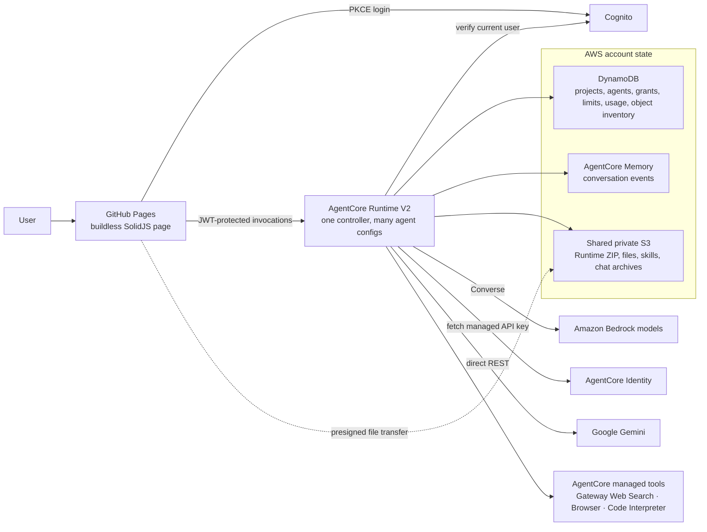

# AgentCore Chat documentation

Start here for the current contract. The deployed product is one buildless
SolidJS page and one V2 AgentCore Runtime backed by Memory, one DynamoDB table,
and one shared S3 bucket. The Runtime is the authorization and accounting
boundary; a Runtime session is an ephemeral performance optimization, not the
owner of conversation or account state.

CloudFormation provisions the shared AWS resources. Agent and project changes
are data changes in the Runtime, not new deployments. The browser never writes
the table or reads managed credentials directly; only presigned file bytes
transfer between the page and S3.

- [ROADMAP-CUTOVER.md](ROADMAP-CUTOVER.md) is the current delivery ledger: what
  shipped, what was verified live, and what remains. Its background/recovery
  section is a future contract, not an implemented worker.
- [ARCHITECTURE.md](ARCHITECTURE.md) explains the deployed shape and local
  development loop. When older details conflict with the cutover ledger, use
  the ledger and current code.
- [TOOLS.md](TOOLS.md) describes implemented managed tools and credential
  scope. `controller.js`, `index.html`, and `tests.js` are the executable
  contract; `npm test` and opt-in live stories establish behavior.

`FOUNDATION.md` records an earlier release. `PLAN.md`, `API-CONTRACT.md`,
`IMPLEMENTATION.md`, `STATUS.md`, `PRODUCT-ROADMAP.md`,
`RUNTIME-DECISION.md`, and `USAGE-RESOURCES.md` are historical design or status
records, not instructions to reintroduce Lambda, Harness, or old quota rules.
